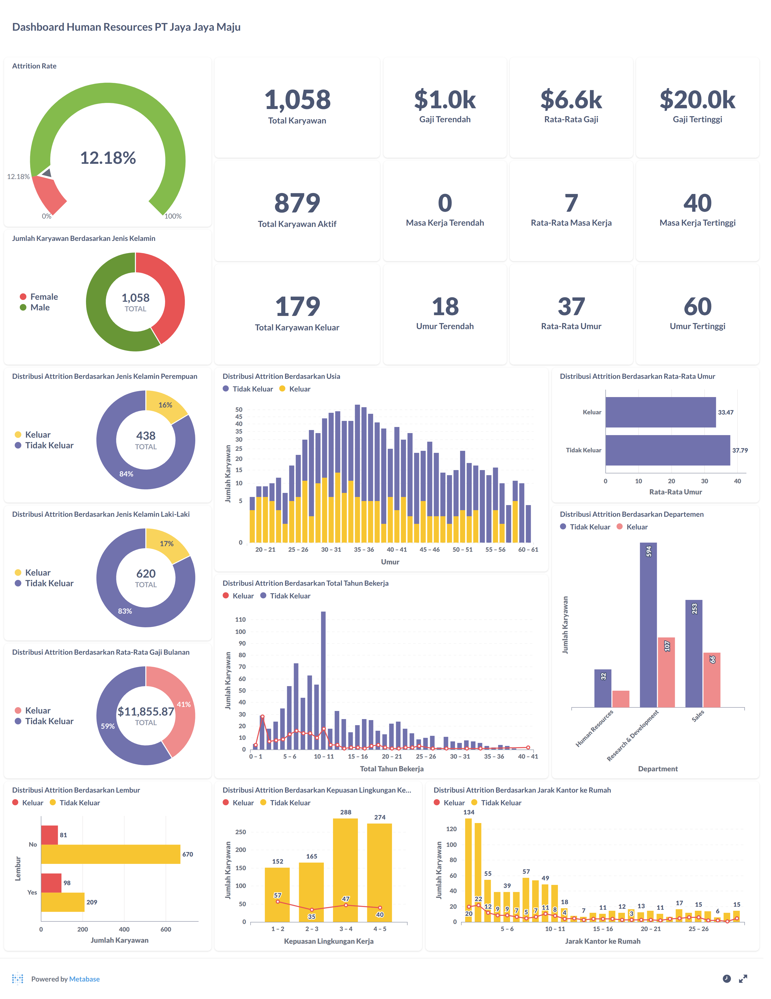

# Menyelesaikan Permasalahan Perusahaan Jaya Jaya Maju

## Business Understanding
Jaya Jaya Maju adalah perusahaan multinasional yang telah berdiri sejak tahun 2000 dan memiliki lebih dari 1000 karyawan yang tersebar di seluruh Indonesia. Meskipun perusahaan telah berkembang pesat, departemen Human Resources (HR) masih menghadapi tantangan dalam pengelolaan karyawan, terutama terkait tingginya angka **attrition rate** (tingkat karyawan yang keluar). Angka attrition yang mencapai lebih dari 10% mengindikasikan potensi masalah serius yang dapat memengaruhi stabilitas operasional perusahaan jika tidak segera ditangani.

## Permasalahan Bisnis
- Tingginya angka attrition rate yang berpotensi memengaruhi efisiensi operasional perusahaan.
- Kurangnya pemahaman mengenai faktor-faktor utama yang menyebabkan karyawan keluar dari perusahaan.
- Tidak adanya sistem monitoring visual yang membantu HR dalam memantau dan menganalisis kondisi karyawan secara berkala.

## Cakupan Proyek
- Melakukan analisis data untuk mengidentifikasi faktor-faktor yang memengaruhi attrition karyawan.
- Membangun model machine learning untuk memprediksi risiko attrition.
- Membangun business dashboard untuk memvisualisasikan data dan mendukung pengambilan keputusan HR.
- Memberikan rekomendasi actionable untuk mengurangi angka attrition.

## Persiapan
- **Sumber data**: Dataset HR Jaya Jaya Maju (file: [employee_data.csv](database/employee_data.csv))
- **Setup environment**:
  - Python 3.11.12
  - Jupyter Notebook / VS Code
  - Library: `pandas`, `numpy`, `matplotlib`, `seaborn`, `scikit-learn`, `imblearn`, `joblib`
  - Metabase untuk pembuatan business dashboard

## Business Dashboard
Dashboard dibangun menggunakan Metabase dan menyajikan visualisasi yang mendalam mengenai kondisi karyawan, termasuk:
- KPI utama (Total Karyawan, Rata-rata Gaji, Attrition Rate, dll)
- Distribusi attrition berdasarkan usia, jenis kelamin, departemen, lembur, jarak rumah-ke-kantor, tingkat kepuasan, dan masa kerja.
- Grafik interaktif yang memudahkan HR dalam menganalisis faktor risiko utama dari waktu ke waktu.

📸 **Contoh visualisasi dapat dilihat pada dashboard berikut**:

  
Click me

  

## Conclusion
Berdasarkan hasil analisis dan visualisasi, ditemukan bahwa beberapa faktor utama yang berkontribusi terhadap tingginya angka attrition adalah:
- Karyawan dengan jam lembur tinggi
- Kepuasan lingkungan kerja yang rendah
- Jarak rumah ke kantor yang jauh
- Masa kerja di bawah 5 tahun
- Umur di bawah 35 tahun

Model prediksi attrition juga berhasil dibangun dengan akurasi yang cukup baik, memberikan gambaran siapa saja yang berpotensi keluar dari perusahaan.

## Rekomendasi Action Items
- Perusahaan perlu mempertimbangkan kenaikan gaji berdasarkan faktor-faktor yang berkontribusi terhadap tingginya angka attrition.
- Meningkatkan kepuasan lingkungan kerja melalui program pengembangan karier, pelatihan, atau sistem reward untuk menekan angka attrition.
- Menerapkan kebijakan kerja fleksibel atau opsi kerja hybrid untuk mengurangi beban karyawan yang tinggal jauh dari kantor.
